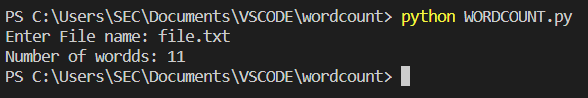

# Word-count
## AIM:
To write a python program for getting the word count from a text.
## EQUIPEMENT'S REQUIRED: 
- PC
- Anaconda - Python 3.7
## ALGORITHM: 
- Step 1:
Open then required file by using the function"with"
- Step 2: 
Using split function to split the words. 
- Step 3: 
Finding the length of the words by using len() function.
- Step 4:  
Calling the function and printing the number of words.
## PROGRAM:
```Python
#Developed By: ROHIT JAIN D
#Register No: 212222230120
n=input('Enter File name: ')
wordslen=0
with open(n,'r') as f:
    for line in f:
        words=line.split()
        wordslen+=len(words)
print("Number of wordds:",wordslen)
```
### OUTPUT:

## RESULT:
Thus the program is written to find the word count from a text.